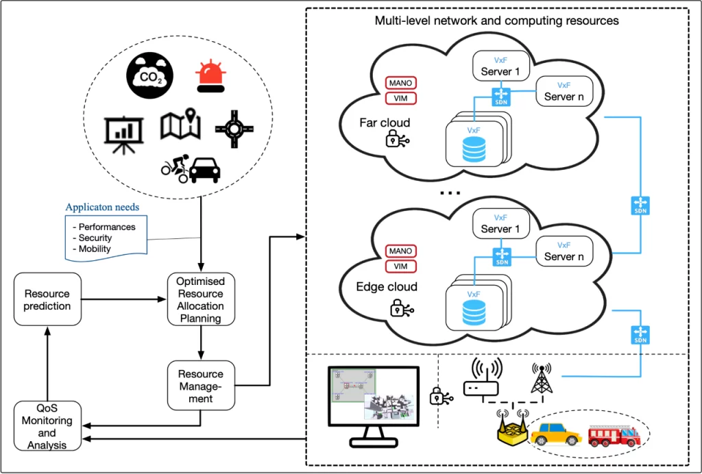

 

The project ONOFRE-3 deals with a 5G/6G ecosystem featured by the heterogeneity of the edge, fog, and cloud processing layers and proper management of dynamic QoS application requirements running on mobile nodes. To overcome this complexity, AI and Machine Learning techniques for contextual information prediction and network management are proposed. AI/ML can also support both offline planning methods and multiaccess coordination and control and be deployed at end devices. In this scenario, security is also mandatory from the start, with advanced cloud data privacy and security techniques, are proposed to be smoothly managed and controlled across different cloud computing domains. Finally, practical evaluation of these mechanisms needs a realistic application scenario with clear requirements. Hence, CCAM and C-ITS verticals are taken for reference evaluation, which provide clearly defined and demanding QoS requirements and serve as reference area to analyse and develop concrete and meaningful benchmarks in a massive latency-bounded slice. ONOFRE-3 studies and tests novel mechanisms at all the involved stages: offline network planning, online provisioning and management, multiple radio access and end devices. We propose to use intelligent orchestration of cloud, fog, and edge computing for CCAM and C-ITS, over a secured framework and supported by AI/ML techniques. The project outcomes are expected to have a significant economic and social impact. Cloud and edge computing advances brought by the project will contribute to the fields that will also drive the future ICT economy. Project results will also directly contribute to improve the Key Enabling Technologies identified for CCAM and should help accelerate its adoption.

<b>Objectives:</b>

<ul>
<li>Study and propose distributed computing and network resources orchestration and coordination mechanisms to overcome the heterogeneity of edge, fog and cloud processing layers in a CCAM and C-ITS scenario.</li>
<li>Monitor operational performance level and predict computing and network resources with AI/ML techniques.</li>
<li>Planning and dynamic allocation of network and computing resources based on predictive context information.</li>
<li>Coordinate available access technologies and optimize operational RAT parameters for C-ITS and CCAM applications.</li>
<li>Propose security mechanisms to deal with threats against the distributed architecture operations, as well as the integration of privacy, data protection, fault tolerance, AAA in the CCAM and C-ITS domain. </li>
<li>Definition and implementation of a set of urban mobility services for evaluation and testing.</li>
</ul>

