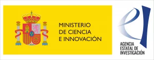

 

To acknowledge ONOFRE-3 in publications, please use any of the following sentences, using the reference of your subproject. <b>This sentence must be mentioned in the first place of the acknowledgement</b> as required by the Ministry.

If the paper is in <b>English</b>:

<ul>
<li>I2CAT: Grant PID2020-112675RB-C43 funded by MCIN/AEI/10.13039/501100011033</li>
<li>UMU:  Grant PID2020-112675RB-C44 funded by MCIN/AEI/10.13039/501100011033</li>
<li>UVA: Grant PID2020-112675RB-C42 funded by MCIN/AEI/10.13039/501100011033</li>
<li>UPCT: Grant PID2020-112675RB-C41 funded by MCIN/AEI/10.13039/501100011033</li>
</ul>

If multiple partners are authors of the publication, please use all of their references, as for example:
Grants PID2020-112675RB-C41 and PID2020-112675RB-C42 funded by MCIN/AEI/10.13039/501100011033

If the paper is in <b>Spanish</b>:

<ul>
<li>I2CAT: Proyecto PID2020-112675RB-C43 financiado por MCIN/AEI/10.13039/501100011033</li>
<li>UMU:  Proyecto PID2020-112675RB-C44 financiado por MCIN/AEI/10.13039/501100011033</li>
<li>UVA: Proyecto PID2020-112675RB-C42financiado por MCIN/AEI/10.13039/501100011033</li>
<li>UPCT: Proyecto PID2020-112675RB-C41 financiado por MCIN/AEI/10.13039/501100011033</li>
</ul>

And for multiple partners use all the references, as for example:  Proyectos PID2020-112675RB-C41 y PID2020-112675RB-C42 financiados por MCIN/AEI/10.13039/501100011033

Please, include also the logo of the funding institution (MCIN/AEI) in any material used for dissemination, including books, multimedia materials, banners, flyers, conference presentations or websites, as follows:

In <b>English:</b>

Grant YOURREFERENCE funded by:

In <b>Spanish:</b>

Ayuda YOURREFERENCE financiada por:

Please, refer to the AIE instructions  <A HREF="https://www.aei.gob.es/sites/default/files/page/field_file/2022-07/20220704_Instrucciones-comunicacion-publicidad-ayudas-concedidas.pdf">here </A>

